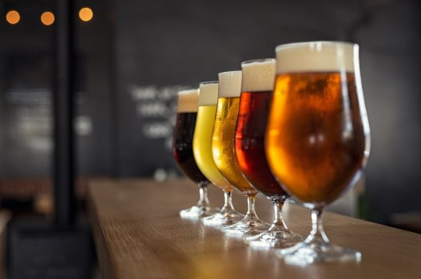

# Craft Beer

### James Allen

#### “Fill with mingled cream and amber,
#### I will drain that glass again.
#### Such hilarious visions clamber
#### Through the chambers of my brain.
#### Quaintest thoughts — queerest fancies,
#### Come to life and fade away:
#### What care I how time advances?
#### I am drinking ale today.”
#### - Edgar Allan Poe

## Working on a craft beer data set to make some visuals, identify takeaways, run some models and then discuss over a beer.

# Executive Summary

- Most popular beer is American IPA

- Average abv of beer is 5.8%

- Most popular beer state is Colorado with 47 Breweries

- Most popular beer city is Portland with over 40 breweries

- Average breweries per state is 10

- Random forest best performing model with 48% accuracy on test data

# Planning

- Initial Thoughts:
    - look at the different beer types
    - how many beers are there?
    - where are the beers brewed?
    - is there a most popular beer type?
    - what state / city are breweries most popular?

# Acquire

- download beer and brewery csv files to local computer
- import csv files into jupyter notebook
- merge csv files together into new dataframe

# Prepare

- use new dataframe from merged csv files
- check for nulls or missing values
- rename columns for readability
- create sub dataframes for exploration
- create model dataframe for modeling

# Explore

- take a look at some beer stats
- plot most popular beers
- look at percentage of popular beers
- look at beer alcohol by volume
- look at breweries by state and city

# Modeling

### KNN

- Train accuracy: 51%

- Validate accuracy: 38%

- Test accuracy: 36%

### Decision Tree

- Train accuracy: 47%

- Validate accuracy: 45%

- Test accuracy: 44%

### Random Forest

- Train accuracy: 51%

- Validate accuracy: 49%

- Test accuracy: 48%

# Conclusion

- Beer is good
- Drink more beer

# Salud
# Prost
# Cheers

## Source

- The beer data was obtained from: [Craft Beer Data](https://www.kaggle.com/nickhould/craft-cans)